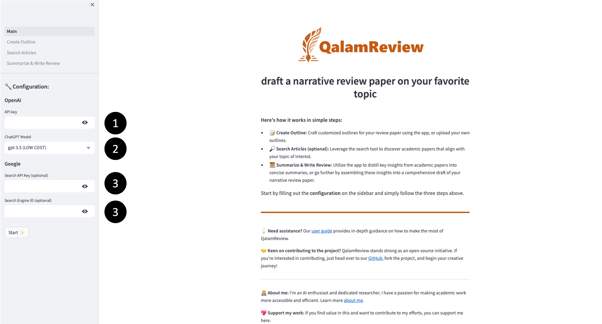
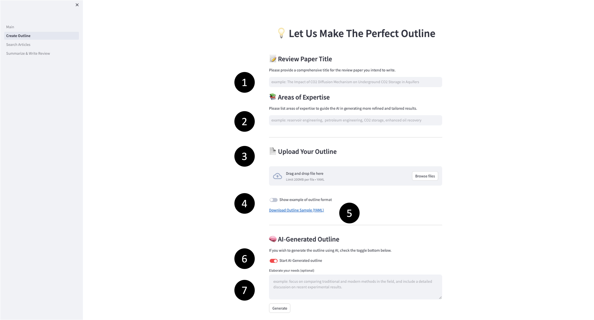
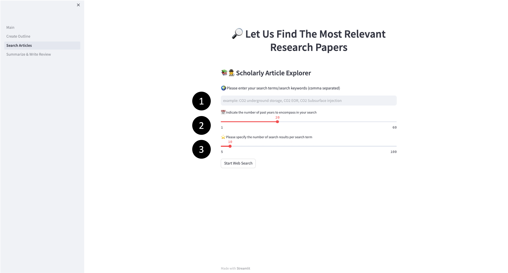
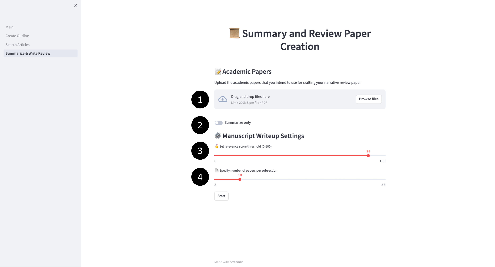

<h1 align="center"><strong>QalamReview User Guide</strong></h1>

## **Table of Contents**

- [Main Page](#main-page)
- [Outline Creation Page](#outline-creation)
- [Web Search Page](#web-search)
- [Review Paper Writing Page](#review-paper-writing-page)

 

## **Main Page**

The main page allows configuring the core settings required for QalamReview to work. Please refer to the accompanying image for visual reference.

**1. OpenAI API Key:** This API key enables integration with LLM models like GPT-3 and GPT-4. To obtain it, follow the simple steps given [here](https://gptforwork.com/help/gpt-for-docs/setup/create-openai-api-key). The key needs to be entered in the provided field.

**2. Model Selection:** Users can choose between two options - **gpt-3.5** or **gpt-3.5 & gpt-4**. gpt-3.5 is faster and more cost-effective but gpt-3.5 & gpt-4 generates more accurate outputs for complex tasks like outline generation and narrative review writing. 

be aware of pricing here.

**3. Custom Search API Key (optional):** For utilizing the web search capability to find relevant papers, this API key is essential. It can be easily obtained from [here](https://developers.google.com/custom-search/v1/overview#api_key) by following these guidelines.

**4. Custom Search Engine ID (optional):** In addition to the API key, the search engine ID is also required to enable web search. To get this ID refer to [this](https://developers.google.com/custom-search/v1/overview#search_engine_id).

 

## **Outline Creation**

This page helps create a structured outline for your review paper. Please refer to the accompanying image for visual reference.

**1. Review Paper Title:** Users need to provide a descriptive title summarizing the essence of their paper. A sample placeholder is given for guidance.

**2. Areas of Expertise:** Specifying the key domains and fields of study that that are relevant to your paper. Listing these fields will enable producing more refined and tailored content. Users can list multiple areas separated by commas.

**3. Upload Outline:** For more control, users can upload their own pre-made outline in the required JSON format. A sample of this formate is provided.

**4 & 5.  View and Download Sample:** To understand the outline format better, users can view the sample outline or download it to modify as needed before uploading.

**6. Generate Outline:** With just the title and domains, QalamReview can automatically generate a detailed outline suitable for the review paper.

**7. Elaborate Needs (optional):** For further customization, users can provide more specifics on what they need the outline to cover

 

## **Web Search**

This page provides an easy way to find relevant papers using Google Search. Please refer to the accompanying image for visual reference.

**1. Past Years:** Adjustable slider to filter papers published in last 1 to 60 years. The available range is from 1 to 60 years, ensuring you can capture both recent and historical scholarly works.

**2. Search Terms:** Adjustable slider to set how many different search terms or keywords to use in the search query. Using multiple search terms can help to narrow down and refine the search results. The slider lets you choose between a minimum of 2 and a maximum of 15 search terms

**3. Results Per Term:** Determines the number of search results (5 to 100) to retrieve for each term. For example, if you've set the slider to 10 and have 3 search terms, you'll get a total of 30 results.

 

## **Review Paper Writing Page**

This page where QalamReview can automatically summarize relevant papers and draft the full narrative review paper based on provided or generated outline. Please refer to the accompanying image for visual reference.

**1. Upload Papers:** Users provide the list of papers they want summarized and included in the review.

**2. Relevancy Cut-off:** Adjustable setting to only include papers in write-up that meet a minimum relevancy score. Helps filter out less useful papers.

If users wish only to summarize papers and obtain their relevancy scores to outline sections, they should set the cut-off score value above 100.

**3. Papers Per Section:** For each section, users can limit the number of papers incorporated in the write-up even if they meet the cut-off score. For instance, if 30 papers qualify based on the cut-off, but the user selects a limit of 10, only the 10 most recent of those will be incorporated.