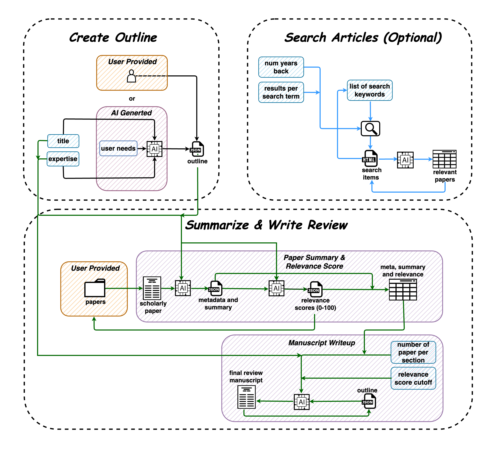

# Summary

Large language models (LLMs) have become essential tools in academic research, particularly for literature reviews and academic writing [@mishra2024use; @nayak2024large]. By efficiently summarizing and extracting information from extensive datasets, LLMs streamline the literature review process and significantly accelerate knowledge discovery[@mishra2024use; @almarie2023editorial]. Moreover, as intelligent writing assistants, they aid researchers in organizing their ideas, refining argument structures, and enhancing the overall quality of academic writing [@nayak2024large; @almarie2023editorial]. QalamReview is an attempt to harness the power of LLMs to automate the extraction of information from academic literature and create complete drafts of narrative review papers. It offers three key features to simplify the review process: Create Outline, enabling users to generate or upload customized outlines; Search Article, which helps researchers find relevant academic papers aligned with their topic using an integrated search tool; and Summarize & Write Review, which synthesizes insights from selected papers into concise summaries or a comprehensive narrative draft. By combining these features, QalamReview highlights the potential of LLMs to enhance efficiency and quality in literature reviews and academic writing, positioning it as a valuable tool for researchers.

# Statement of Need

Literature reviews are a fundamental component of academic research, serving as the initial step for researchers to evaluate progress in specific domains and identify knowledge gaps[@Hecker_Kalpokas_2024]. This critical process ensures that subsequent research either builds upon existing findings or introduces novel contributions. However, conducting a comprehensive literature review is a time-intensive endeavor, requiring researchers to navigate through an extensive corpus of publications to extract pertinent insight [@Panse_2024]. This challenge is further amplified for non-native English speakers, who face additional linguistic barriers in comprehending and synthesizing academic content24 [@hyland2016academic; @Eby_2023].

The process of collecting and summarizing material reflective of prior work in a given field is often followed by a reluctance to transform these efforts into a comprehensive review paper, due to the additional time and resources required [@mitchell2022challenges]. Despite the significance of such publications in facilitating future research and benefiting society at large, this step is frequently deprioritized [@Panse_2024]. To address these challenges, QalamReview has been developed as an open-source tool designed to streamline the discovery, summarization, and synthesis of academic research. This tool not only aids researchers in efficiently extracting and summarizing content but also integrates these insights into a complete draft of a narrative review paper, thereby conserving time and enhancing the accessibility of valuable academic insights.

# Application Architecture

The architecture of QalamReview consists of three interconnected modules, each designed to streamline different aspects of the narrative review process (\autoref{fig:arch}). The first module focuses on Outline Creation, where researchers can generate outlines for their proposed literature reviews. By providing key details such as the title, description, and areas of expertise relevant to their research, this module leverages large language models (e.g., ChatGPT) to craft an initial draft of the outline. Additionally, researchers have the flexibility to upload their predefined outlines, ensuring that the module accommodates both automated and user-defined inputs. The second module is Search Articles, which enables researchers to discover relevant academic papers efficiently. Users can provide specific search keywords, and the module utilizes large language models in conjunction with the Google Search engine to find relevant papers based on the given keywords. The search results, including metadata, abstract, and download links for the identified papers, are stored in a CSV file, allowing researchers to review the findings and select papers for further analysis.

The final module, Summary and Paper Write-Up, is designed to summarize selected papers and draft a complete narrative review. Researchers begin by uploading PDF files of the selected papers relevant to their study. The module processes each file, generating a comprehensive summary for each paper using an LLM. These summaries are then evaluated for relevance to the subsections of the proposed outline, with the LLM assigning a relevance score ranging from 0 to 100. Both the summaries and their relevance scores are stored in a CSV file, which forms the basis for the write-up process. Using this CSV, the module systematically works through the outline sections, applying user-defined filters to select the most relevant papers for each section based on their scores. The LLM then synthesizes the findings from these papers to create a cohesive narrative for each subsection of the outline. This process continues iteratively until the entire outline is addressed. The final draft, complete with proper citations and references, is compiled into a Word document, providing researchers with a well-structured narrative review that can be further refined and analyzed.

# References