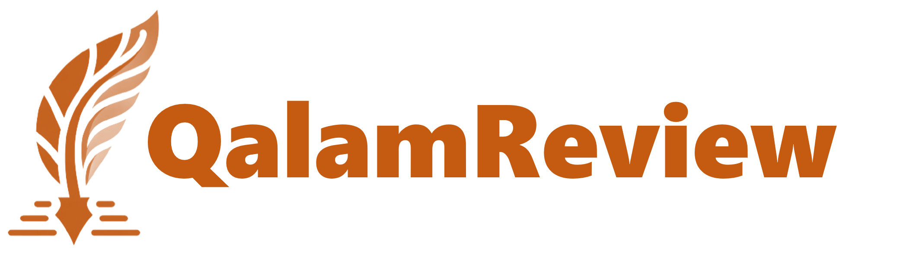
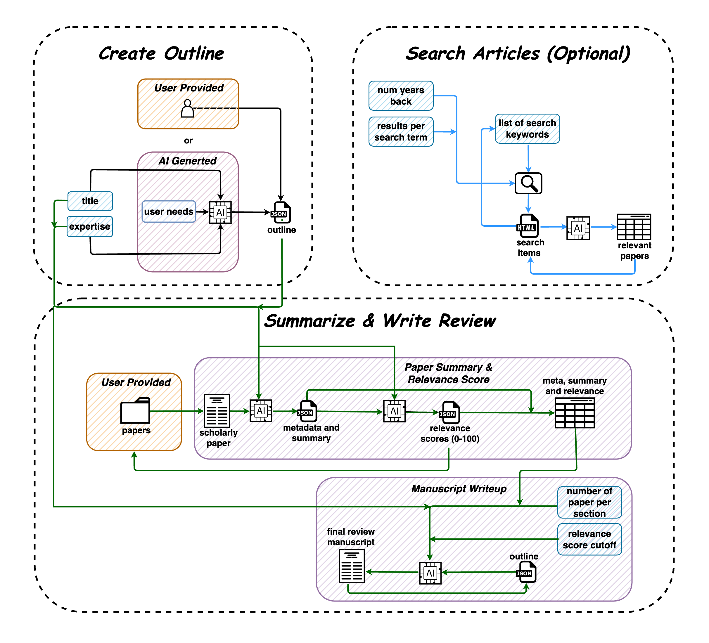

## ⚡ **draft a narrative review paper on your favorite topic** ⚡

[](https://github.com/Ahmed-0357/QalamReview/blob/main/LICENSE)
[](https://star-history.com/#Ahmed-0357/QalamReview)
[](https://github.com/Ahmed-0357/QalamReview/issues)

**In the vast world of academia, navigating through a multitude of academic articles to compose a review paper can be an overwhelming task. QalamReview simplifies this process with advanced large language models, helping you efficiently create a narrative review on your chosen topic.**

<br>

## **📖 Documentation**

Explore the [User Guide](docs/user_guide.md) to discover how to maximize your experience with QalamReview.

<br>

## **🚀 Features and Workflow**

### **1. 📝 Create Outline**

- Craft customized outlines for your review paper using the app, or upload your own outlines.

### **2. 🔎 Search Article (Optional)**

- Leverage the search tool to discover academic papers that align with your topic of interest.
  
### **3. 📜 Summarize & Write Review**

- Utilize the app to distill key insights from academic papers into concise summaries, or go further by assembling these insights into a comprehensive draft of your narrative review paper

<br>

## **🏗️ Project Architecture**



<br>

## **🤝 Contribution**

As an open-source initiative, we deeply appreciate and encourage community contributions. Whether it's through introducing new features, optimizing our existing framework, or enriching our documentation, your involvement is invaluable to us.

**🎯 Todos:**

- Adding other large language models.
- Refinement of system and user prompts.
- Develop a more advanced summarization algorithm.
- Implement integration with academic search engines like Microsoft Academic Research and Google Scholar to augment article search functionality.
- Enable extraction of tables, equations, and figures from academic papers.

<br>

## **🌟 Acknowledgements**


## **📌 Cite**

If you build upon this work, please cite our paper as follows.
```
```
