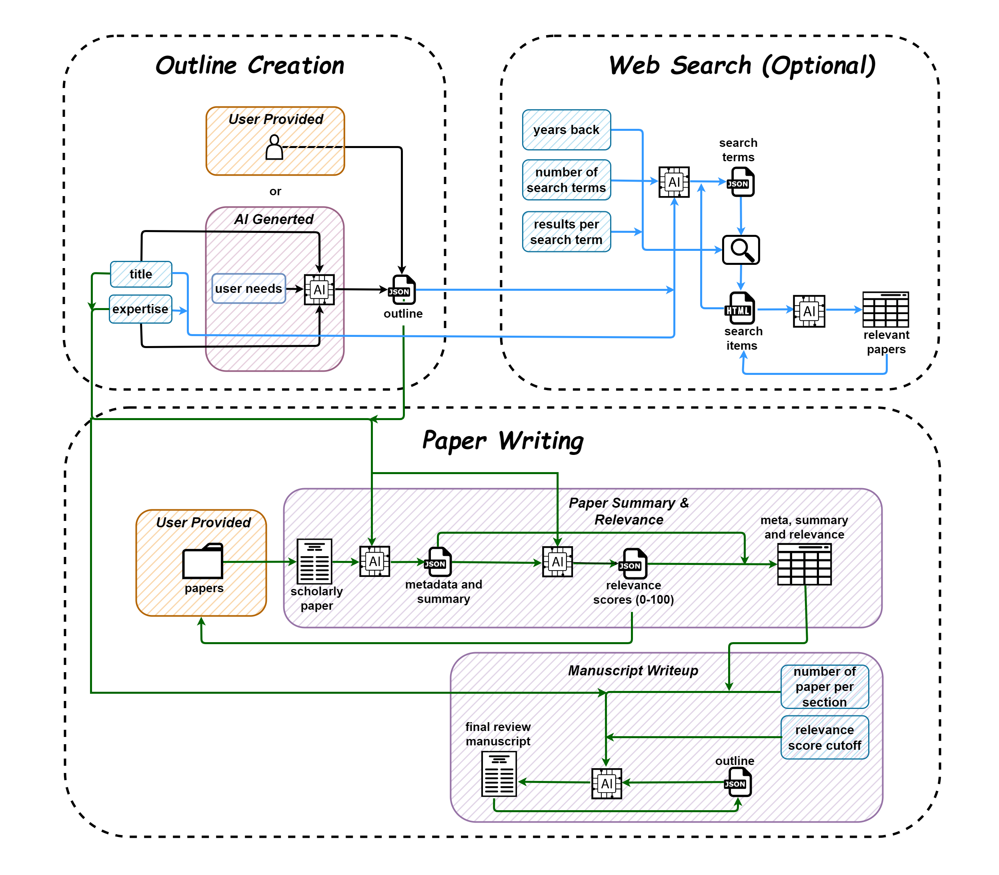

# **🖋️ QalamReview**

## ⚡ **draft a narrative review paper on your favorite topic** ⚡

In the vast world of academia, scanning through numerous research articles to draft a review can be daunting. QalamReview harnesses the power of large language models, allowing you to effortlessly compile insights and draft your narrative review paper on any topic of your choice.

 

## 🏗️ Project Architecture

 

## 🤝 contribution

As an open-source project in a rapidly developing field, we highly value and welcome contributions. Whether you're offering innovative features, refining our current setup, or enhancing our documentation, your input is essential.

**🎯 Anticipated Features & Improvements on Our Radar**:

- Integration with Google Scholar for enhanced article searches.
- Introduce a parsing feature for tables, equations, and figures from user-provided articles.
- Incorporation of other advanced language models.
- Refinement of system and user prompts.
- Improved summarization scheme.